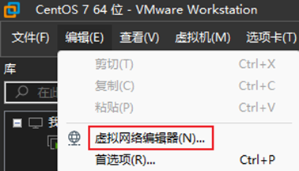
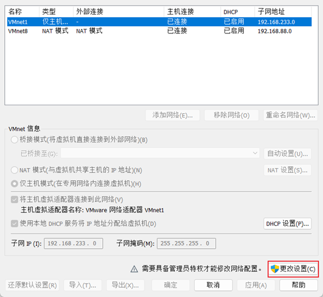
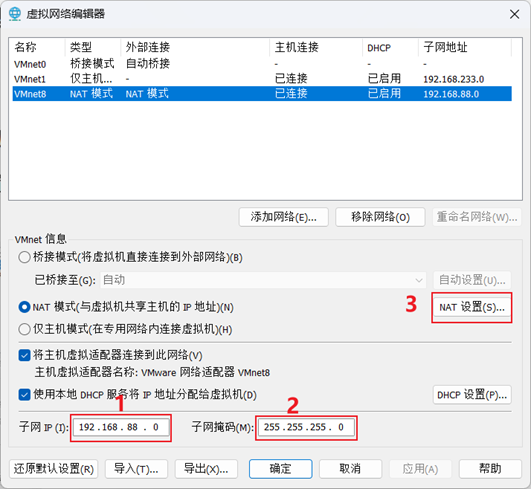
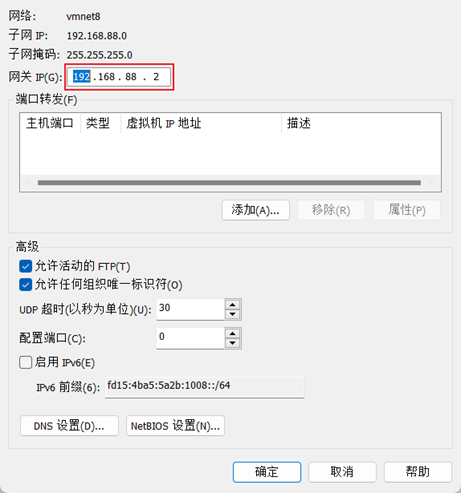
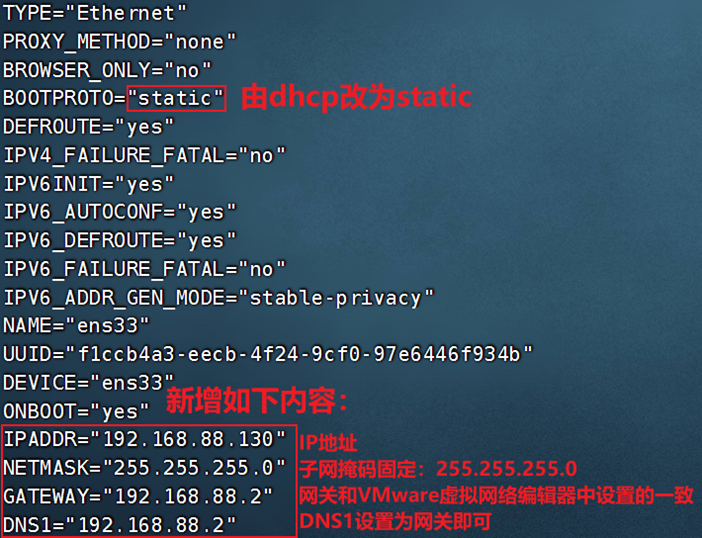
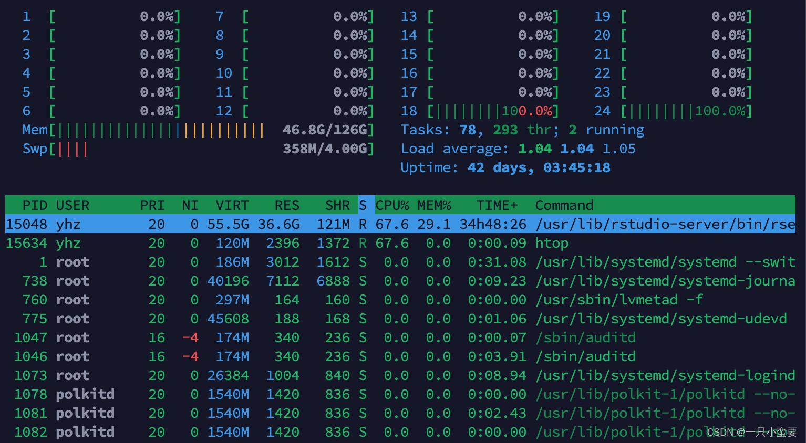
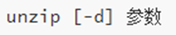

[TOC]


# Linux基础命令


## Linux的目录结构


- `/`，根目录是最顶级的目录了
- Linux只有一个顶级目录：`/`
- 路径描述的层次关系同样适用`/`来表示
- /home/itheima/a.txt，表示根目录下的home文件夹内有itheima文件夹，内有a.txt


## ls命令

功能：列出文件夹信息

语法：`ls [-l -h -a] [参数]`

- 参数：被查看的文件夹，不提供参数，表示查看当前工作目录
- -l，以列表形式查看
- -h，配合-l，以更加人性化的方式显示文件大小
- -a，显示隐藏文件

```bash
# 当不使用选项和参数，直接使用ls命令本体，表示：以平铺形式，列出当前工作目录下的内容,即HOME目录
(base) flyvideo@flyvideo:~$ ls
anaconda3  Documents  Music   mySata    Public   snap      Templates
Desktop    Downloads  mybert  Pictures  sensors  software  Videos
```

Linux系统的命令行终端，在启动的时候，默认会加载:

- 当前登录用户的HOME目录作为当前工作目录，所以ls命令列出的是HOME目录的内容

- HOME目录：每个Linux操作用户在Linux系统的个人账户目录，路径在：/home/用户名

​	•如，图中的Linux用户是itheima，其HOME目录是：/home/itheima


​	•Windows系统和Linux系统，均设有用户的HOME目录，如图：


### 隐藏文件、文件夹

在Linux中以`.`开头的，均是隐藏的。

默认不显示出来，需要`-a`选项才可查看到。


## pwd命令

功能：展示当前工作目录

语法：`pwd`


## cd命令

功能：切换工作目录

语法：`cd [目标目录]`

参数：目标目录，要切换去的地方，不提供默认切换到`当前登录用户HOME目录`


## HOME目录

每一个用户在Linux系统中都有自己的专属工作目录，称之为HOME目录。

- 普通用户的HOME目录，默认在：`/home/用户名`

- root用户的HOME目录，在：`/root`


FinalShell登陆终端后，默认的工作目录就是用户的HOME目录


## 相对路径、绝对路径

- 相对路径，非`/`开头的称之为相对路径

  相对路径表示以`当前目录`作为起点，去描述路径，如`test/a.txt`，表示当前工作目录内的test文件夹内的a.txt文件

- 绝对路径，以`/`开头的称之为绝对路径

  绝对路径从`根`开始描述路径


## 特殊路径符

- `.`，表示当前，比如./a.txt，表示当前文件夹内的`a.txt`文件
- `..`，表示上级目录，比如`../`表示上级目录，`../../`表示上级的上级目录
- `~`，表示用户的HOME目录，比如`cd ~`，即可切回用户HOME目录


## mkdir命令

功能：通过mkdir命令可以创建新的目录（文件夹）(Make Directory)

语法：`mkdir [-p] 参数`

- 参数：必填，表示Linux路径，即要创建的文件夹的路径，相对路径或绝对路径均可
- 选项：-p，表示自动创建不存在的父目录，适用于创建连续多层级的目录

**案例：**

如果想要一次性创建多个层级的目录，如下图：


会报错，因为上级目录itcast和good并不存在，所以无法创建666目录

可以通过-p选项，将一整个链条都创建完成。


> **注意：创建文件夹需要修改权限，请确保操作均在HOME目录内，不要在HOME外操作**
>
> **涉及到权限问题，HOME外无法成功**
>
> **后续我们会讲解权限管控的知识**

## touch命令

功能：创建文件

语法：`touch 参数`

- 参数：touch命令无选项，参数必填，表示要创建的文件路径，相对、绝对、特殊路径符均可以使用


## cat命令

功能：查看文件内容

语法：`cat 参数`

- 参数：cat同样没有选项，只有必填参数，参数表示：被查看的文件路径，相对、绝对、特殊路径符都可以使用


## more命令

功能：查看文件，可以支持翻页查看

语法：`more 参数`

- 参数：同样没有选项，只有必填参数，参数表示：被查看的文件路径，相对、绝对、特殊路径符都可以使用
- 在查看过程中：
  - `空格`键翻页
  - `q`退出查看

more命令同样可以查看文件内容，同cat不同的是：

- cat是直接将内容全部显示出来
- more支持翻页，如果文件内容过多，可以一页页的展示

## cp命令

功能：复制文件、文件夹

语法：`cp [-r] 参数1 参数2`

- 参数1，Linux路径，表示被复制的文件或者文件夹
- 参数2，Linux路径，表示要复制去的地方
- 选项：-r，可选，复制文件夹使用，表示递归

示例：

- cp a.txt b.txt，复制当前目录下a.txt为b.txt
- cp a.txt test/，复制当前目录a.txt到test文件夹内
- cp -r test test2，复制文件夹test到当前文件夹内为test2存在

**示例演示：**

**复制文件：**


**复制文件夹：**


> **注意：**复制文件夹，必须使用-r选项，否则不会生效


## mv命令

功能： 用于移动文件、文件夹，来自英文单词：move

语法：`mv 参数1 参数2`

- 参数1，Linux路径，表示被移动的文件或文件夹
- 参数2，Linux路径，表示要移动去的地方，如果目标不存在，**则进行改名(如下图2)**，确保目标存在

**示例演示：**


## rm命令

功能：删除文件、文件夹，来自英文单词remove

语法：`rm [-r -f] 参数...参数`

- 参数：支持多个，每一个表示被删除的，空格进行分隔

- 选项：-r，同cp命令一样，删除文件夹使用

- 选项：-f，表示force，强制删除(不会给出确认提示)，一般root用户会用到

  •普通用户删除内容不会弹出提示，只有root管理员用户删除内容会有提示

  •所以一般普通用户用不到-f选项

- 参数也支持通配符 *，用以做模糊匹配


> rm命令很危险，一定要注意，特别是切换到root用户的时候。

**示例演示：**

•删除文件


•删除多个文件


•删除文件夹，如下图，必须使用-r选项才可以


•演示强制删除，-f选项

•可以通过 su - root，并输入密码123456（和普通用户默认一样）临时切换到root用户体验

•通过输入exit命令，退回普通用户。（临时用root，用完记得退出，不要一直用，关于root我们后面会讲解）


**rm命令支持通配符 *，用来做模糊匹配：**

- 符号* 表示通配符，即匹配任意内容（包含空），示例：
- test*，表示匹配任何以test开头的内容
- *test，表示匹配任何以test结尾的内容
- *test *，表示匹配任何包含test的内容

演示：

- 删除所有以test开头的文件或文件夹


> **注意：**
>
> 


## which命令

功能：查看命令的程序本体文件路径

语法：`which 参数`

- 参数：被查看的命令


## find命令

功能：搜索文件

语法1按文件名搜索：`find 路径 -name 参数`

- 路径，搜索的起始路径
- 参数，搜索的关键字，支持通配符*， 比如：`*`test表示搜索任意以test结尾的文件


## grep命令

功能：过滤关键字

语法：`grep [-n] 关键字 文件路径`

- 选项-n，可选，表示在结果中显示匹配的行的行号。
- 参数，关键字，必填，表示过滤的关键字，带有空格或其它特殊符号，建议使用””将关键字包围起来
- 参数，文件路径，必填，表示要过滤内容的文件路径，可作为内容输入端口


> 参数文件路径，可以作为管道符的输入


## wc命令

功能：统计

语法：`wc [-c -m -l -w] 文件路径`

- 选项，-c，统计bytes数量
- 选项，-m，统计字符数量
- 选项，-l，统计行数
- 选项，-w，统计单词数量
- 参数，文件路径，被统计的文件，可作为内容输入端口


> 参数文件路径，可作为管道符的输入


## 管道符|

写法：`|`

功能：将符号左边的结果，作为符号右边的输入

示例：

`cat a.txt | grep itheima`，将cat a.txt的结果，作为grep命令的输入，用来过滤`itheima`关键字


可以支持嵌套：

`cat a.txt | grep itheima | grep itcast`


## echo命令

功能：输出内容

语法：`echo 参数`

- 参数：被输出的内容


## `反引号

功能：被两个反引号包围的内容，会作为命令执行

示例：

- echo \`pwd\`，会输出当前工作目录


## tail命令

功能：查看文件尾部内容

语法：`tail [-f] 参数`

- 参数：被查看的文件
- 选项：-f，持续跟踪文件修改


## head命令

功能：查看文件头部内容

语法：`head [-n] 参数`

- 参数：被查看的文件
- 选项：-n，查看的行数


## 重定向符

功能：将符号左边的结果，输出到右边指定的文件中去

- `>`，表示覆盖输出
- `>>`，表示追加输出


## vi编辑器

**命令模式快捷键：**

|   模式   | 命令  |                描述                 |
| :------: | :---: | :---------------------------------: |
| 命令模式 |  `i`  |    在当前光标位置进入`输入模式`     |
| 命令模式 |  `a`  | 在当前光标位置 之后 进入`输入模式`  |
| 命令模式 |  `I`  |   在当前行的开头，进入`输入模式`    |
| 命令模式 |  `A`  |   在当前行的结尾，进入`输入模式`    |
| 命令模式 |  `o`  |   在当前光标下一行进入`输入模式`    |
| 命令模式 |   O   |   在当前光标上一行进入`输入模式`    |
| 输入模式 | `ESC` | 任何情况下输入`ESC`都能回到命令模式 |

| 模式     |    命令    |               描述               |
| -------- | :--------: | :------------------------------: |
| 命令模式 |    `上`    |           向上移动光标           |
| 命令模式 |    `下`    |           向下移动光标           |
| 命令模式 |    `左`    |           向左移动光标           |
| 命令模式 |    `右`    |           向右移动光标           |
| 命令模式 |    `0`     |      移动光标到当前行的开头      |
| 命令模式 |    `$`     |      移动光标到当前行的结尾      |
| 命令模式 |  `pageup`  |             向上翻页             |
| 命令模式 | `pagedown` |             向下翻页             |
| 命令模式 |    `/`     |           进入搜索模式           |
| 命令模式 |    `n`     |           向下继续搜索           |
| 命令模式 |    `N`     |           向上继续搜索           |
| 命令模式 |    `dd`    |       删除光标所在行的内容       |
| 命令模式 |   `ndd`    | n是数字，表示删除当前光标向下n行 |
| 命令模式 |    `yy`    |            复制当前行            |
| 命令模式 |   `nyy`    |  n是数字，复制当前行和下面的n行  |
| 命令模式 |    `p`     |          粘贴复制的内容          |
| 命令模式 |    `u`     |             撤销修改             |
| 命令模式 |  `ctrl+r`  |           反向撤销修改           |
| 命令模式 |    `gg`    |             跳到首行             |
| 命令模式 |    `G`     |             跳到行尾             |
| 命令模式 |    `dG`    |    从当前行开始，向下全部删除    |
| 命令模式 |   `dgg`    |    从当前行开始，向下全部删除    |
| 命令模式 |    `d$`    | 从当前光标开始，删除到本行的结尾 |
| 命令模式 |    `d0`    |  从当前行开始，删除到本行的开头  |


**底线命令快捷键：**

|     模式     |     命令      |     描述     |
| :----------: | :-----------: | :----------: |
| 底线命令模式 |     `:wq`     |  保存并退出  |
| 底线命令模式 |     `:q`      |    仅退出    |
| 底线命令模式 |     `:q!`     |   强制退出   |
| 底线命令模式 |     `:w`      |    仅保存    |
| 底线命令模式 | **`:set nu`** | **显示行号** |
| 底线命令模式 | `:set paste`  | 设置粘贴模式 |


## 命令的选项

我们学习的一系列Linux命令，它们所拥有的选项都是非常多的。

比如，简单的ls命令就有：-a -A -b -c -C -d -D -f -F -g -G -h -H -i -I -k -l -L -m -n -N -o -p -q -Q -r-R -s -S -t -T -u -U -v -w -x -X -1等选项，可以发现选项是极其多的。

课程中， 并不会将全部的选项都进行讲解，否则，一个ls命令就可能讲解2小时之久。

课程中，会对常见的选项进行讲解， 足够满足绝大多数的学习、工作场景。


### 查看命令的帮助

可以通过：`命令 --help`查看命令的帮助手册


### 查看命令的详细手册

可以通过：`man 命令`查看某命令的详细手册


# Linux常用操作

### 各类小技巧（快捷键）

**强制停止：**Ctrl + C

**退出或登出：**Ctrl + D       ps：不能用于退出vi/vim

**历史命令搜索：**history

- 可以通过：!命令前缀，自动执行上一次匹配前缀的命令

  

- 可以通过快捷键：Ctrl + R，输入内容去匹配历史命令

  

​	如果搜索到的内容是你需要的，那么：

- 回车键可以直接执行
- 键盘左右键，可以得到此命令（不执行）

**光标移动快捷键：**

- Ctrl + A，跳到命令开头
- Ctrl + E，跳到命令结尾
- Ctrl + 键盘左键，向左跳一个单词
- Ctrl + 键盘右键，向右跳一个单词

**清屏：**

- 通过快捷键ctrl + l，可以清空终端内容
- 或通过命令clear得到同样效果

## 关机重启

下表总结了这四个命令的区别和用法：

|      命令       |     功能     | 关机通知消息 | 需要手动断开电源 |
| :-------------: | :----------: | :----------: | :--------------: |
|     reboot      | 重新启动系统 |      否      |        否        |
| shutdown -r now | 重新启动系统 |      是      |        否        |
|    poweroff     | 完全关闭系统 |      否      |        是        |
|      halt       | 完全关闭系统 |      否      |        是        |

​	根据实际需求，选择合适的命令来进行关机或重启操作。如果需要快速重启系统且不需要关机通知消息，则可以使用`reboot`命令。如果需要重启系统并显示关机通知消息，则可以使用`shutdown -r now`命令。如果只需要完全关闭系统而不重新启动，则可以使用`poweroff`命令或`halt`命令。

​	在Ubuntu Linux中，有多种命令可用于关闭或重新启动系统。`reboot`命令用于快速重新启动系统，`shutdown -r now`命令用于重启系统并显示关机通知消息，`poweroff`命令用于完全关闭系统，而`halt`命令也用于完全关闭系统但需要手动断开电源连接。根据具体需求，选择适当的命令来管理系统的关机和重启操作。


## 软件安装

操作系统安装软件有许多种方式，一般分为：

**下载安装包自行安装**

- **如win系统使用exe文件、msi文件等**
- **如mac系统使用dmg文件、pkg文件等**

**系统的应用商店内安装**

- **如win系统有Microsoft Store商店**
- **如mac系统有AppStore商店**

**CentOS系统使用：**

- yum [install remove search] [-y] 软件名称
  - install 安装
  - remove 卸载
  - search 搜索
  - -y，自动确认

**Ubuntu系统使用：**

- apt [install remove search] [-y] 软件名称
  - install 安装
  - remove 卸载
  - search 搜索
  - -y，自动确认

> yum 和 apt 均需要root权限
>
> yum命令需要root权限哦，可以su切换到root，或使用sudo提权。
>
> yum命令需要联网

**snap命令安装-扩展**

- 通过Snap可以安装众多的软件包。需要注意的是，snap是一种全新的软件包管理方式，它类似一个容器拥有一个应用程序所有的文件和库，各个应用程序之间完全独立。所以使用snap包的好处就是它解决了应用程序之间的依赖问题，使应用程序之间更容易管理。但是由此带来的问题就是它占用更多的磁盘空间。

## systemctl

功能：可以控制软件（服务）的启动、关闭、开机自启动

- 系统内置服务均可被systemctl控制
- 第三方软件，如果自动注册了可以被systemctl控制
- 第三方软件，如果没有自动注册，可以手动注册

说明：Linux系统很多软件（内置或第三方）均支持使用systemctl命令控制：启动、停止、开机自启，能够被systemctl管理的软件，一般也称之为：服务

语法：`systemctl start | stop | restart | disable | enable | status 服务名`

- start，启动
- stop，停止
- status，查看状态
- disable，关闭开机自启
- enable，开启开机自启
- restart，重启

系统内置的服务比较多，比如：

- NetworkManager，主网络服务

- network，副网络服务

- firewalld，防火墙服务

- sshd，ssh服务（FinalShell远程登录Linux使用的就是这个服务）

除了内置的服务以外，部分第三方软件安装后也可以以systemctl进行控制。

- yum install -y ntp，安装ntp软件

​	可以通过ntpd服务名，配合systemctl进行控制

- yum install -y httpd，安装apache服务器软件

​	可以通过httpd服务名，配合systemctl进行控制

部分软件安装后没有自动集成到systemctl中，我们可以手动添加。


## 软链接

功能：在系统中创建软链接，可以将文件、文件夹链接到其它位置。类似Windows系统中的《快捷方式》。

语法：`ln -s 参数1 参数2`

- -s 选项，创建软连接
- 参数1：被链接的文件或文件夹
- 参数2：要链接去的地方（快捷方式的名称和存放位置）

```bash
# 实例：
ln -s /etc/yum.conf ~/yum.conf
ln -s /etc/yum ~/yum

```


## 日期

作用：通过date命令可以在命令行中查看系统的时间

语法：`date [-d] [+格式化字符串]`

- -d 按照给定的字符串显示日期，一般用于日期计算

- 格式化字符串：通过特定的字符串标记，来控制显示的日期格式
  - %Y   年%y   年份后两位数字 (00~99)
  - %m   月份 (01~12)
  - %d   日 (01~31)
  - %H   小时 (00~23)
  - %M   分钟 (00~59)
  - %S   秒 (00~60)
  - %s   自 1970-01-01 00:00:00 UTC 到现在的秒数（时间戳）


示例：

- 使用date命令本体，无选项，直接查看时间

  

  > **可以看到这个格式非常的不习惯。我们可以通过格式化字符串自定义显示格式**

- 按照2022-01-01的格式显示日期

  

- 按照2022-01-01 10:00:00的格式显示日期

  

  > **由于中间带有空格，所以使用双引号包围格式化字符串，作为整体。**

- -d选项日期计算

  

  - 支持的时间标记为：

    


## 时区

> Linux系统默认时区非中国的东八区，修改时区为中国时区

使用root权限，执行如下命令，修改时区为东八区时区


将系统自带的localtime文件删除，并将/usr/share/zoneinfo/Asia/Shanghai文件链接为localtime文件即可


## ntp

功能：自动校准系统时间

安装：`yum install -y ntp`

启动管理：`systemctl start | stop | restart | status | disable | enable ntpd`

启动并设置开机自启：

- systemctl start ntpd
- systemctl enable ntpd

当ntpd启动后会定期的帮助我们联网校准系统的时间


- 也可以手动校准（需root权限）：ntpdate -u ntp.aliyun.com

通过阿里云提供的服务网址配合ntpdate（安装ntp后会附带这个命令）命令自动校准


## 和网络有关的命令

### 1.IP地址

每一台联网的电脑都会有一个地址，用于和其它计算机进行通讯

IP地址主要有2个版本，V4版本和V6版本（V6很少用，课程暂不涉及）

IPv4版本的地址格式是：a.b.c.d，其中abcd表示0~255的数字，如192.168.88.101就是一个标准的IP地址


特殊IP：

- 127.0.0.1，表示本机
- 0.0.0.0，特殊IP地址
  - 可以用于指代本机
  - 可以在端口绑定中用来确定绑定关系
  - 在一些IP地址限制中，表示所有IP的意思，如放行规则设置为0.0.0.0，表示允许任意IP访问


可以通过命令查看IP：ifconfig，查看本机的ip地址，如无法使用ifconfig命令，可以安装：yum -y install net-tools


> 主网卡：一般Centos的主网卡叫ens33，inet表示ip地址


### ifconfig命令

ifconfig命令用于显示和配置Linux系统的网络接口，比如IP地址、子网掩码、MAC地址等等。它也可以用于启动或停止某个网络接口。

**基本用法如下所示：**

```bash
ifconfig [网络接口] [选项]
```

其中，网络接口可以是网络接口的名称，比如eth0、eth1等等。选项可以是以下任意组合：

- `up`：启动网络接口
- `down`：停止网络接口
- `inet [IP地址]`：设置网络接口的IP地址
- `netmask [子网掩码]`：设置网络接口的子网掩码
- `hw [MAC地址]`：设置网络接口的MAC地址

**案例：**

```bash
ifconfig eth0 up
ifconfig eth0 inet 192.168.1.10 netmask 255.255.255.0
ifconfig eth0 hw ether 00:11:22:33:44:55
```

这个示例中，我们首先启动了eth0网络接口，然后设置了其IP地址为192.168.1.10，子网掩码为255.255.255.0，最后设置了其MAC地址为00:11:22:33:44:55。

> 在Windows下主机的IP查看命令：ipconfig/all
>
> 

### 2.主机名

每一台电脑除了对外联络地址（IP地址）以外，也可以有一个名字，称之为主机名

无论是Windows或Linux系统，都可以给系统设置主机名

- Windows系统主机名


- Linux系统主机名


功能：查看Linux系统主机的名称，Windows也适用

查看：`hostname`

设置：`hostnamectl set-hostname 主机名`

- 可以使用命令：hostname查看主机名


- 可以使用命令：hostnamectl set-hostname 主机名，修改主机名（需root）


### 3.配置VMware固定IP

> 为什么需要固定IP?
>
> 当前我们虚拟机的Linux操作系统，其IP地址是通过DHCP服务获取的。
>
> DHCP：动态获取IP地址，即每次重启设备后都会获取一次，可能导致IP地址频繁变更
>
> 原因1：办公电脑IP地址变化无所谓，但是我们要远程连接到Linux系统，如果IP地址经常变化我们就要频繁修改适配很麻烦
>
> 原因2：在刚刚我们配置了虚拟机IP地址和主机名的映射，如果IP频繁更改，我们也需要频繁更新映射关系
>
> 综上所述，我们需要IP地址固定下来，不要变化了。

配置固定IP需要2个大步骤：

1.在VMware Workstation（或Fusion）中配置IP地址网关和网段（IP地址的范围）

2.在Linux系统中手动修改配置文件，固定IP

首先让我们，先进行第一步，跟随图片进行操作









现在进行第二步，在Linux系统中修改固定IP

•使用vim编辑/etc/sysconfig/network-scripts/ifcfg-ens33文件，填入如下内容



•执行：systemctl restart network 重启网卡，执行ifconfig即可看到ip地址固定为192.168.88.130了

示例文件内容：

```shell
TYPE="Ethernet"
PROXY_METHOD="none"
BROWSER_ONLY="no"
BOOTPROTO="static"			# 改为static，固定IP
DEFROUTE="yes"
IPV4_FAILURE_FATAL="no"
IPV6INIT="yes"
IPV6_AUTOCONF="yes"
IPV6_DEFROUTE="yes"
IPV6_FAILURE_FATAL="no"
IPV6_ADDR_GEN_MODE="stable-privacy"
NAME="ens33"
UUID="1b0011cb-0d2e-4eaa-8a11-af7d50ebc876"
DEVICE="ens33"
ONBOOT="yes"
IPADDR="192.168.88.131"		# IP地址，自己设置，要匹配网络范围
NETMASK="255.255.255.0"		# 子网掩码，固定写法255.255.255.0
GATEWAY="192.168.88.2"		# 网关，要和VMware中配置的一致
DNS1="192.168.88.2"			# DNS1服务器，和网关一致即可
```


### 4.ping命令

测试网络是否联通

语法：`ping [-c num] 参数`


### 5.域名解析

IP地址实在是难以记忆，有没有什么办法可以通过主机名或替代的字符地址去代替数字化的IP地址呢？

实际上，我们一直都是通过字符化的地址去访问服务器，很少指定IP地址

比如，我们在浏览器内打开：www.baidu.com，会打开百度的网址

其中，www.baidu.com，是百度的网址，我们称之为：域名

> 不是说通过IP地址才能访问服务器吗？
>
> 为什么域名这一串好记的字符，也可以呢？
>
> 这一切，都是域名解析帮助我们解决的。

访问www.baidu.com的流程如下：


即：

- 先查看本机的记录（私人地址本）
  - Windows看：C:\Windows\System32\drivers\etc\hosts
  - Linux看：/etc/hosts
- 前一步如果没有再联网去DNS服务器（如114.114.114.114，8.8.8.8等）询问

#### 配置主机名映射

> 比如，我们FinalShell是通过IP地址连接到的Linux服务器，那有没有可能通过域名（主机名）连接呢？
>
> 可以，我们只需要在Windows系统的：C:\Windows\System32\drivers\etc\hosts文件中配置记录即可


## 和进程有关的命令

### 1.ps命令

功能：查看进程信息

语法：`ps -ef`，查看全部进程信息，可以搭配grep做过滤：`ps -ef | grep xxx`


### 2.kill命令


### 3.top命令


功能：查看主机运行状态

- `top`是 Linux 系统中的一个基本的命令行工具，用于实时监视系统的进程、CPU 使用情况、内存占用、负载情况等系统资源。
- `top`命令的界面比较简洁，主要以文本形式展示进程列表和系统资源占用情况。
- `top`命令的操作相对简单，常见的操作如按键切换排序方式、查看不同资源的使用情况、结束进程等。

语法：`top`，查看基础信息


可用选项：


交互式模式中，可用快捷键：


### 4.htop命令



- `htop`是一个类似于`top`的进程查看工具，提供了更丰富的功能和更友好的用户界面。
- `htop`命令的界面更加直观，使用彩色标记和条形图等形式展示进程列表、CPU、内存、交换空间、负载等信息。
- `htop`命令支持更多的交互操作，如使用鼠标点击、快捷键切换排序方式、查看和设置进程优先级、终止进程等。
- `htop`还提供了一些额外的功能，如在进程列表中搜索、监视指定用户的进程等

#### `htop`显示界面

接下来，我们着重介绍一下我更爱的`htop`的显示界面！

> 注意：`htop`的界面可能会因操作系统和版本而略有不同，咱们今天说的都是基于常见的情况，具体细节可能会有所差异哟！

`htop`命令显示的界面主要由以下四个部分组成：

1. 标题栏（Header Bar）：位于界面的顶部，显示系统的整体状态，包括 CPU 使用率、内存占用、进程数等。
2. 进程列表（Process List）：位于界面的主要部分，显示当前运行的进程及其相关信息。每行表示一个进程，列显示进程的 ID、用户、CPU 使用率、内存占用、进程状态等信息。
3. 柱状图区域（Graphs Area）：位于界面的左侧或右侧或顶部（咱们文中的在顶部），以柱状图的形式展示系统资源的使用情况，如 CPU 使用率、内存占用、磁盘读写等。
4. 快捷键提示栏（Shortcut Keys Bar）：位于界面的底部，显示常用的快捷键操作，帮助用户快速了解和使用`htop`的功能，便于管理控制。
   


## nmap命令


## netstat命令

功能：查看端口占用

用法：`netstat -anp | grep xxx`


### 


## wget命令

wget是非交互式的文件下载器，可以在命令行内下载网络文件

语法：`wget [-b] url`

- 选项：-b，可选，后台下载，会将日志写入到当前工作目录的wget-log文件

- 参数：url，下载链接

示例：

- 下载apache-hadoop 3.3.0版本：`wget http://archive.apache.org/dist/hadoop/common/hadoop-3.3.0/hadoop-3.3.0.tar.gz`


- 在后台下载：`wget -b http://archive.apache.org/dist/hadoop/common/hadoop-3.3.0/hadoop-3.3.0.tar.gz`

- 通过tail命令可以监控后台下载进度：`tail -f wget-log`

> 注意：无论下载是否完成，都会生成要下载的文件，如果下载未完成，请及时清理未完成的不可用文件。


## curl命令

curl可以发送http网络请求，可用于：下载文件、获取信息等

语法：`curl [-O] url`

- 选项：-O，用于下载文件，当url是下载链接时，可以使用此选项保存文件

- 参数：url，要发起请求的网络地址\

示例：

- 向cip.cc发起网络请求：`curl cip.cc`


- 向python.itheima.com发起网络请求：`curl python.itheima.com`

- 通过curl下载hadoop-3.3.0安装包：`curl -O http://archive.apache.org/dist/hadoop/common/hadoop-3.3.0/hadoop-3.3.0.tar.gz `


## df命令

查看磁盘占用


## iostat命令

查看CPU、磁盘的相关信息


## sar命令

查看网络统计


## 环境变量

- 临时设置：export 变量名=变量值
- 永久设置：
  - 针对用户，设置用户HOME目录内：`.bashrc`文件
  - 针对全局，设置`/etc/profile`


### PATH变量

记录了执行程序的搜索路径

可以将自定义路径加入PATH内，实现自定义命令在任意地方均可执行的效果


## $符号

可以取出指定的环境变量的值

语法：`$变量名`

示例：

`echo $PATH`，输出PATH环境变量的值

`echo ${PATH}ABC`，输出PATH环境变量的值以及ABC

如果变量名和其它内容混淆在一起，可以使用${}


## 压缩解压

### 压缩格式

市面上有非常多的压缩格式

​	•zip格式：Linux、Windows、MacOS，常用

​	•7zip：Windows系统常用

​	•rar：Windows系统常用

​	•tar：Linux、MacOS常用

​	•gzip：Linux、MacOS常用

在Windows系统中常用的软件如：winrar、bandizip等软件，都支持各类常见的压缩格式，这里不多做讨论。

我们现在要学习，如何在Linux系统中操作：tar、gzip、zip这三种压缩格式

完成文件的压缩、解压操作。

### tar

Linux和Mac系统常用有2种压缩格式，后缀名分别是：

​	• .tar，称之为tarball，归档文件，即简单的将文件组装到一个.tar的文件内，并没有太多文件体积的减少，仅仅是简单的封装

​	• .gz，也常见为.tar.gz，gzip格式压缩文件，即使用gzip压缩算法将文件压缩到一个文件内，可以极大的减少压缩后的体积

针对这两种格式，使用tar命令均可以进行压缩和解压缩的操作

语法：

​	• -c，创建压缩文件，用于压缩模式

​	• -v，显示压缩、解压过程，用于查看进度

​	•- x，解压模式

​	•- f，要创建的文件，或要解压的文件，-f选项必须在所有选项中位置处于最后一个

​	•- z，gzip模式，不使用-z就是普通的tarball格式

​	•- C，选择解压的目的地，用于解压模式


**压缩：**

`tar -zcvf 压缩包 被压缩1...被压缩2...被压缩N`

- -z表示使用gzip，可以不写

**解压：**

`tar -zxvf 被解压的文件 -C 要解压去的地方`

- -z表示使用gzip，可以省略
- -C，可以省略，指定要解压去的地方，不写解压到当前目录

**tar的常用压缩组合为：**

```bash
# 将1.txt 2.txt 3.txt 压缩到test.tar文件内
tar -cvf test.tar 1.txt 2.txt 3.txt
```

```bash
# 将1.txt 2.txt 3.txt 压缩到test.tar.gz文件内，使用gzip模式
tar -zcvf test.tar.gz 1.txt 2.txt 3.txt
```

注意：

•-z选项如果使用的话，一般处于选项位第一个

•-f选项，必须在选项位最后一个


**tar的常用解压组合有：**

```bash
# 解压test.tar，将文件解压至当前目录
tar -xvf test.tar

# 解压test.tar，将文件解压至指定目录（/home/itheima）
tar -xvf test.tar -C /home/itheima

# 以Gzip模式解压test.tar.gz，将文件解压至指定目录（/home/itheima）
tar -zxvf test.tar.gz -C /home/itheima
```

**注意：**

•-f选项，必须在选项组合体的最后一位

•-z选项，建议在开头位置

•-C选项单独使用，和解压所需的其它参数分开


### zip

**压缩：**

可以使用zip命令，压缩文件为zip压缩包

语法：

​	• -r，被压缩的包含文件夹的时候，需要使用-r选项，和rm、cp等命令的-r效果一致

**示例：**

```bash
# 将a.txt b.txt c.txt 压缩到test.zip文件内
zip test.zip a.txt b.txt c.txt

# 将test、itheima两个文件夹和a.txt文件，压缩到test.zip文件内
zip -r test.zip test itheima a.txt
```


**解压：**

使用unzip命令，可以方便的解压zip压缩包

语法：

​	•-d，指定要解压去的位置，同tar的-C选项

​	•参数，被解压的zip压缩包文件

**示例：**

```bash
# 将test.zip解压到当前目录
unzip test.zip

# 将test.zip解压到指定文件夹内（/home/itheima）
unzip test.zip -d /home/itheima
```


## su命令

切换用户

语法：`su [-] [用户]`


## sudo命令


比如：

```shell
itheima ALL=(ALL)       NOPASSWD: ALL
```

在visudo内配置如上内容，可以让itheima用户，无需密码直接使用`sudo`


## chmod命令

修改文件、文件夹权限


语法：`chmod [-R] 权限 参数`

- 权限，要设置的权限，比如755，表示：`rwxr-xr-x`

  

- 参数，被修改的文件、文件夹

- 选项-R，设置文件夹和其内部全部内容一样生效


## chown命令

修改文件、文件夹所属用户、组


语法：`chown [-R] [用户][:][用户组] 文件或文件夹`


## 用户组管理


## 用户管理


## genenv命令

- `getenv group`，查看系统全部的用户组

  

- `getenv passwd`，查看系统全部的用户

  


## env命令

查看系统全部的环境变量

语法：`env`


# 补充

## 1.snap

通过Snap可以安装众多的软件包。需要注意的是，snap是一种全新的软件包管理方式，它类似一个容器拥有一个应用程序所有的文件和库，各个应用程序之间完全独立。所以使用snap包的好处就是它解决了应用程序之间的依赖问题，使应用程序之间更容易管理。但是由此带来的问题就是它占用更多的磁盘空间

### snap list

查看通过snap安装的snap包


### snap [-y] [install/search/remove]  包名

```bash
# 可以搜索想要的snap包，例如tomcat
sudo snap search tomcat
# 安装snap包
sudo snap install tomcat-sample
# 删除一个snap包
sudo snap remove tomcat


```

安装路径统一在：


## 2.终端复用器

**作用：**通过终端使用Linux时比较纠结的是一个终端通常同一时间只能做一件事，虽然可以将任务放入后台，但是对于有输出或交互的任务放入后台并不是一个好的选择。另一个比较纠结的问题是任务无法脱离终端运行，如果使用基础的命令使其脱离后台运行，下次就没法在终端中交互管理该任务了。**对于上面这些问题一般使用screen和tmux等终端复用与管理工具来处理。**

**使用场景：**很多新手经常碰到的问题就是按照网上的教程组了个服务器，然后安装运行了某些服务器软件，比如网站服务器、游戏服务器这些，然后退出终端后服务器就不工作了。使用screen和tmux这些工具就能很好的解决这个问题。**screen和tmux这类工具的出现给linux服务器的使用带来了很大的便利，借助这些工具你可以让所有工作都在前台跑着，或者随意换电脑登陆继续之前的工作。**

### **screen**

#### 快速入门

- **安装**
  在Debian和Ubuntu等系统中可以使用下面命令安装screen：
  `sudo apt install screen`
- **创建新会话**
  `screen` 创建新会话并进入；
  `screen -S name` 创建一个名为name的会话并进入；（推荐做法）
- **退出会话**
  在screen创建的会话中依次按下键盘 `ctrl + a` `ctrl + d` 或者 `ctrl + a` `d` 退出当前会话；
- **列出已创建的会话**
  使用 `screen -ls` 可以列出已创建的会话，分别显示pid号、会话名称、创建时间、状态（Detached-分离、Attached-连接）；
- **重新进入会话**
  `screen -r pid` 使用pid号重新进入；
  `screen -r name` 使用会话名称重新进入；
  如果已经在一个会话中想要换到另一个会话，选项可以使用 `-d -r` ；
- **关闭会话**
  在screen创建的会话中可以依次按下键盘 `ctrl + a` `k` 关闭当前会话，也可以输入exit命令来关闭；


screen在创建后还可以不在当前会话中通过名称或编号直接传递指令运行，这个通常用于编写脚本使用：

```bash
#!/bin/bash

# 会话名
screen_name="screen_name"
screen -dmS $screen_name

# 要运行的命令
cmd="top";

# 向指定的会话传输内容（注意最后的回车使命令生效）
screen -x -S $screen_name -p 0 -X stuff "$cmd\n"

# 可以使用下面方式关闭会话
screen -x -S $screen_name -p 0 -X quit
1234567891011121314
```

#### 更多介绍

其它常用选项：

| 选项  | 描述                                    |
| ----- | --------------------------------------- |
| -d    | 将指定的会话从终端分离 置为Detached     |
| -R    | 重新进入会话 若没有该会话则新建会话     |
| -wipe | 列出已创建的会话 并清除状态为dead的会话 |

其它常用键绑定：

| 键绑定         | 描述           |
| -------------- | -------------- |
| `ctrl + a` `?` | 查询所有键绑定 |
| `ctrl + a` `x` | 锁定当前会话   |

更多内容可以参考 `man screen` 或是下面链接：
https://www.gnu.org/software/screen/

### tmux

#### 快速入门

tmux基础功能和screen差不多，但是目前来说tmux总体上比screen更加好用些。

- **安装**
  在Debian和Ubuntu等系统中可以使用下面命令安装tmux：
  `sudo apt install tmux`
- **创建新会话**
  `tmux` 创建新会话并进入；
  `tmux new -s name` 创建一个名为name的会话并进入；（推荐做法）
  tmux创建的会话会在他话名、窗口名、主机名、时间等信息；
- **退出会话**
  在tmux创建的会话中依次按下键盘 `ctrl + b` `d` 退出当前会话；
- **列出已创建的会话**
  使用 `tmux ls` 可以列出已创建的会话，会话名称、会话含有的窗口数、创建时间；
  如果已经在tmux创建的会话中的话也可以依次按下键盘 **`ctrl + b` `s`** 进行查看，这个功能比较厉害，还可以**预览各个会话的内容，并选择切换**；
- **重新进入会话**
  `tmux a -t name` 使用会话名称重新进入已存在的会话；
  如果已经在tmux创建的会话中的话也可以使用 `tmux switch -t name` 切换会话（没有 `ctrl + b` `s` 来的好用）；
- **关闭会话**
  `tmux kill-session -t name` 使用会话名称关闭已有会话；
  如果已经在tmux创建的会话中的并且只有一个窗口和窗格的情况下可以按下键盘 `ctrl + d` 关闭当前会话；
- **重命名会话**
  `tmux rename-session -t old-name new-name`

 

**要注意的是在tmux创建的会话中无法通过滚轮上下来查看历史信息，需要依次按下键盘上 `ctrl + b` `PgUp` ，接着就可以使用 `PgUp` `PgDn` `↑` `↓` 来查看历史信息了，按下 `q` 退出。**

到目前位置tmux和前面的screen其实还是没有太大差别的，主要是快捷键、选项以及小部分操作上有些不同，真正区别大的是tmux的每个会话中还有窗口和窗格的概念。

#### 窗口与窗格

一个tmux的会话中可以有多个窗口(window)，每个窗口又可以分割成多个窗格(pane)。对窗口和窗格相关操作都是在会话中进行的。

- **新建窗口**
  在会话中依次按下键盘 `ctrl + b` `c` 创建新窗口；
  多个窗口下底部带*标记的为当前活动窗口；
- **切换窗口**
  `ctrl + b` `w` 列出所有窗口，可以预览并选择切换；
  `ctrl + b` `0` 切换到0号窗口，依此类推；
  `ctrl + b` `p` 上一个窗口；
  `ctrl + b` `n` 下一个窗口；
- **关闭窗口**
  `ctrl + b` `&` 关闭当前窗口，会提示，按下y并回车确定；
  当前窗口只有一个窗格的情况下可以按下键盘 `ctrl + d` 关闭当前窗口；


如果把前面的会话看做是一个excel文件的话，那窗口就像是其中的一张张sheet。再接下去的窗格就开始魔幻了：

- **新建窗格**
  `ctrl + b` `%` 将当前窗口垂直分割；
  `ctrl + b` `"` 将当前窗口水平分割；
- **切换窗格**
  `ctrl + b` `↑` 、`ctrl + b` `↓` 、`ctrl + b` `←` 、`ctrl + b` `→`
- **调整窗格**
  `ctrl + b` `space` 依次切换窗格布局；
  `ctrl + b` `{` 当前窗格与上一个窗格交换位置；
  `ctrl + b` `}` 当前窗格与下一个窗格交换位置；
- **缩放窗格**
  `ctrl + b` `z` 当前窗格全屏显示，再使用一次会变回原来大小；
- **拆分窗格**
  `ctrl + b` `!` 将当前窗格拆分为一个独立窗口；
- **关闭窗格**
  `ctrl + b` `x` 关闭当前窗口，会提示，按下y并回车确定；
  也可以按下键盘 `ctrl + d` 关闭当前窗口，不会提示；


#### 更多介绍

tmux内容挺多的，更多内容可以参考 `man tmux` 或是下面链接：
https://github.com/tmux/tmux

tmux可以创建很多的会话、窗口、窗格，如果用的多的话在系统重启或崩溃的情况下一个个恢复就比较纠结了。针对这个情况甚至出了附加的工具来管理这些内容，参考如下：https://tmuxp.git-pull.com/


## 3.内网穿透并搭建配置使用

参考链接：https://juejin.cn/post/7042486792011907086

> 实现内网穿需要有一台公网服务器、域名。*（本文将公网服务器称为服务端，内网服务器称为客户端）*

### frp 是什么

- frp 是一个专注于内网穿透的高性能的反向代理应用，支持 TCP、UDP、HTTP、HTTPS 等多种协议。可以将内网服务以安全、便捷的方式通过具有公网 IP 节点的中转暴露到公网。

**有了内网穿透你能干什么？**

- 远程访问内网的 http/https 服务
- 远程桌面(Windows/Mac)
- 远程文件、 SSH
- 小程序开发

有了内网穿透在外访问家里的电脑、NAS、树莓派、摄像头等网络设备或远程控制，那都不是事儿~

### 安装

官方项目地址：[github.com/fatedier/fr…](https://link.juejin.cn/?target=https%3A%2F%2Flink.zhihu.com%2F%3Ftarget%3Dhttps%3A%2F%2Fgithub.com%2Ffatedier%2Ffrp)

> 以下命令请在服务器中执行

```shell
# 下载
wget https://github.com/fatedier/frp/releases/download/v0.38.0/frp_0.38.0_linux_amd64.tar.gz
# 解压
tar -xvf frp_0.38.0_linux_amd64.tar.gz 
```


```shell
# 移动至/usr/local
mkdir /usr/local/frp
mv frp_0.38.0_linux_amd64/* /usr/local/frp/
```

**文件说明**

`frps.ini`: 服务端配置文件 `frps`: 服务端软件 `frpc.ini`: 客户端配置文件 `frpc`: 客户端软件

### 配置systemctl来控制服务端运行

```shell
# vim新建文件并写入配置内容
vim /usr/lib/systemd/system/frp.service
```

写入以下内容，注意上文移动放置的路径和此处有关。这里是启动的**服务端**。

```powershell
[Unit]
Description=The nginx HTTP and reverse proxy server
After=network.target remote-fs.target nss-lookup.target

[Service]
Type=simple
ExecStart=/usr/local/frp/frps -c /usr/local/frp/frps.ini
KillSignal=SIGQUIT
TimeoutStopSec=5
KillMode=process
PrivateTmp=true
StandardOutput=syslog
StandardError=inherit

[Install]
WantedBy=multi-user.target
```


```shell
# 重新加载服务的配置文件
systemctl daemon-reload
```

**现在就可以用 systemctl 套装来控制 frp 了**

```shell
# 启动/停止/重启，查看状态，设置开机自启/关闭开机自启
systemctl start frp
systemctl stop frp
systemctl restart frp
systemctl status frp
systemctl enable frp
systemctl disable frp
```


### 配置和使用

#### 服务端

**frps.ini**

**ini复制代码：**

```ini
[common] #必须设置
bind_port = 7000 #是自己设定的frp服务端端口
vhost_http_port = 80 #是自己设定的http访问端口
token = 123  #核实身份用，加了更安全

[ssh] #ssh反向代理(不是必须设置)
listen_port = 6000 是自己设定的ssh访问端口

[web] #http反向代理[]里的内容可以自己设定，但是客户端和服务端必须要对应(如[aaa],[bbb])；
type = http #为服务类型，可以设为http,https
custom_domains = test1.a.com #为要映射的域名，记得域名的A记录要解析到外网主机的IP。

[web2] #同上(可设置多个)
```

**示例**

```ini
[common]
bind_port = 7000
vhost_http_port = 80

[ssh]
listen_port = 6000

[web]
type = http
custom_domains = test1.a.com

[web2]
type = http
custom_domains = test2.a.com
```

**启动**

**shell复制代码：**

```shell
./frps -c ./frps.ini

# 后台启动
nohup ./frps -c ./frps.ini &
```


#### 客户端

**frpc.ini**

**ini复制代码：**

```ini
[common]
server_addr = 远程frp服务器ip
server_port = 远程frp服务器端口
token = 远程frp服务器token

[http]
type = http
local_ip = 127.0.0.1
local_port = 本地端口号
remote_port = 远程frp服务器的http服务端口号
custom_domains = 自定义配置的域名
subdomain = 匹配服务端配置的subdomain_host
```

**示例**

```ini
[common]
server_addr = xx.xx.xx.xx
server_port = 7000
token = 123

[web] 
type = http
custom_domains = xx.xx.xx.xx
local_ip = 127.0.0.1
local_port = 8080
custom_domains = xxx.xxx.xxx
subdomain = k2p
```

**启动**

**shell复制代码：**

```shell
./frpc -c ./frpc.ini

# 后台启动
nohup ./frpc -c ./frpc.ini &
```


### 访问内网http/https服务

#### 客户端配置

```ini
[common]
server_addr = FRP服务端IP
server_port = 7000
vhost_http_port = 80 #可自定义
vhost_https_port = 443 #可自定义
token= 123

[web] 
type = http
local_ip = 127.0.0.1
local_port = 8080
custom_domains = 自定义域名
```

运行服务后访问 **custom_domains:vhost_http_port **

示例：[http://123.123.123.123](https://link.juejin.cn/?target=http%3A%2F%2F123.123.123.123) 80可以省略

### 连接内网SSH

#### 客户端配置

```ini
[common]
server_addr = FRP服务端IP
server_port = 7000
token= 123

[ssh]
type = tcp
local_ip = 127.0.0.1
local_port = 22
remote_port = 6000
```

运行服务后使用 ssh 工具直接连接即可

```shell
ssh 用户名@服务端ip  -p 端口号
# ssh youhun@x.x.x.x -p 6000 （将 x.x.x.x 替换成公网服务器 IP 地址）
```

### 远程连接Windows电脑(RDP)

#### 准备工作

1.服务器放开端口 `3389`也可以自定义，我这里用 `7001`

2.开启windows电脑的`允许远程连接`

**桌面 -> 此电脑 -> 图标右键 -> 属性 -> 远程设置 -> 修改为允许远程连接到此计算机**


**Win10 以上系统直接设置中打开远程桌面即可**


#### 客户端配置

```ini
[common]
server_addr = FRP服务端IP
server_port = 7000
token= 123

[RDP]
type = tcp
local_ip = 127.0.0.1
local_port = 3389
remote_port = 7001
```

#### 新建 RDP 连接

现在我们在外网任意一台电脑，搜索并打开windows远程桌面程序


输入 `服务器IP:remote_port` 例如：1.2.3.4:7001，就可以连接到内网的windows了。


在此过程中需要输入内网电脑的用户名和开机密码后才能进行远程操控。

#### 设置开机自启

windows 设置开机自启的方法有很多，这里推荐使用`winsw`将frp注册为系统服务。

参考链接：[blog.csdn.net/atmosphere_…](https://link.juejin.cn/?target=https%3A%2F%2Fblog.csdn.net%2Fatmosphere_%2Farticle%2Fdetails%2F104018900)

这个方法最稳定，这是我最终用的方法。

### 远程连接Mac电脑(VNC)

#### 准备工作

1.服务器放开端口 `5900`

2.进入 Mac 的【系统偏好设置】->【共享】，勾选“屏幕共享”和“远程登录”，用户为“所有用户”


#### 客户端配置

```ini
[common]
server_addr = FRP服务端IP
server_port = 7000
token = 123

[vnc]
type = tcp
local_ip = 127.0.0.1
local_port = 5900
remote_port = 5900
use_encryption = true
use_compression = true
```

#### 新建 VNC 连接


连接成功后，输入 Mac 的用户名和密码就行

#### 设置开机自启

1.进入内网 Mac 系统，执行下列操作

```shell
# 编辑自启动文件
touch ~/Library/LaunchAgents/frpc.plist
vim ~/Library/LaunchAgents/frpc.plist
```

2.`frpc.plist` 文件内容如下，注意文件中的 `frpc` 和 `frpc.ini` 路径，可以将这两个文件移到下方配置文件的路径下或者修改为你的路径

```xml
<?xml version="1.0" encoding="UTF-8"?>
<!DOCTYPE plist PUBLIC -//Apple Computer//DTD PLIST 1.0//EN
http://www.apple.com/DTDs/PropertyList-1.0.dtd >
<plist version="1.0">
<dict>
    <key>Label</key>
    <string>frpc</string>
    <key>ProgramArguments</key>
    <array>
     <string>/usr/local/bin/frpc/frpc</string>
         <string>-c</string>
     <string>/usr/local/bin/frpc/frpc.ini</string>
    </array>
    <key>KeepAlive</key>
    <true/>
    <key>RunAtLoad</key>
    <true/>
</dict>
</plist>
```

3.加载并生效

```shell
sudo chown root ~/Library/LaunchAgents/frpc.plist
sudo launchctl load -w ~/Library/LaunchAgents/frpc.plist
```

### 绑定域名

#### 取消端口访问http服务

每次访问域名都需要加上端口很麻烦，可以设置 Nginx 转发

在客户端配置文件中设置域名，记得将域名解析到公网 IP

```ini
[web] 
type = http
local_ip = 127.0.0.1
local_port = 8080
custom_domains = test.iyouhun.com;
```

然后设置 Nginx 转发

```nginx
...
server {
          listen 80; #监听http的80端口
          server_name test.iyouhun.com;  # 这是我们设置的域名
          access_log  logs/test.iyouhun.com.log  main; # 记录日志
          location / {
                  proxy_pass http://127.0.0.1:7001; # 转发到我们在frps.ini中设置的vhost_http_port端口
                  proxy_set_header    Host            $host:80;  #不添加这行时访问需要 域名:7001才能访问到内网的机器，如果加了就不再需要后面的端口，直接使用域名访问
                  proxy_set_header    X-Real-IP       $remote_addr;
                  proxy_set_header    X-Forwarded-For $proxy_add_x_forwarded_for;
                  proxy_hide_header   X-Powered-By;
          }
  
}
...
```

#### 配置泛域名(frp默认域名)

**域名解析**

解析两条A记录：`frp.xxx.com` 和 `*.frp.xxx.com`，都指向你的云服务器ip，稍等一会，`ping frp.xxx.com`，如果能`ping`通说明解析成功

**配置服务端**

```ini
# frps.ini
[common]
bind_port = 7000
...
subdomain_host = frp.xxx.com
```

**客户端使用**

```ini
# frpc.ini
[web] 
type = http
local_ip = 127.0.0.1
local_port = 8080
# 与frps中的subdomain_host连接起来就是 test.frp.xxx.com
subdomain = test #自定义域名前缀
```

访问域名：`test.frp.xxx.com:vhost_http_port`

注：如果 frps 配置了 `subdomain_host`，则 `custom_domains` 中不能是属于 `subdomain_host` 的子域名或者泛域名。

#### 配置Nginx

还是老样子，每次都加端口访问太麻烦了，因此使用 Nginx 做下转发

```nginx
server {
	# 监听的80端口
	listen 80;
	# 域名配置 记得一定要加上*.frp.xxx.com这个，只加frp.xxx.com是不行的
	server_name * .frp.xxx.com frp.xxx.com;
	location / {
		proxy_pass http: //127.0.0.1:8080;
		# 这个Host的header一定要加，不然转发后frp拿不到通过哪个域名访问的，导致转发失败
		proxy_set_header Host $host;
	}
}
```

### 相关问题

#### 启动不了

服务端和客户端启动不了的情况下,并且没有报错误,有概率是因为文件没有执行权限

```shell
# 赋值权限命令
chomd 777 文件名
```

#### 服务端启动报错 Exec format error

```shell
/frpc: cannot execute binary file: Exec format error
```

这是下载错文件了，下载的 FRP 与操作系统处理器架构不匹配，需要重新下载正确的文件。

可以使用 `arch`、`uname -a` 等命令查看系统架构。

```shell
shell复制代码arch
#x86_64
```

#### vue 项目出现Invalid Host header解决办法

// vue.config.js文件中增加`disableHostCheck`属性

```json
module.exports = {
  devServer: {
    disableHostCheck: true
  }
}
```

## 4.scp传输文件命令

#### 1.软件：安装dukto

教程：https://ubuntuhandbook.org/index.php/2021/07/install-dukto-ubuntu-ppa/

#### 2.scp命令

scp 命令用于 Linux 之间复制文件和目录。

scp 是 secure copy 的缩写, scp 是 linux 系统下基于 ssh 登陆进行安全的远程文件拷贝命令。

scp 是加密的，rcp是不加密的，scp 是 rcp 的加强版。

#### 语法

```
scp [-1246BCpqrv] [-c cipher] [-F ssh_config] [-i identity_file] [-l limit] [-o ssh_option] [-P port] [-S program]
[[user@]host1:]file1 [...] [[user@]host2:]file2
```

简易写法:

```
scp [可选参数] file_source file_target 
```

**参数说明：**

- -1： 强制scp命令使用协议ssh1

- -2： 强制scp命令使用协议ssh2

- -4： 强制scp命令只使用IPv4寻址

- -6： 强制scp命令只使用IPv6寻址

- -B： 使用批处理模式（传输过程中不询问传输口令或短语）

- -C： 允许压缩。（将-C标志传递给ssh，从而打开压缩功能）

- -p：保留原文件的修改时间，访问时间和访问权限。

- -q： 不显示传输进度条。

- -r： 递归复制整个目录。

- -v：详细方式显示输出。scp和ssh(1)会显示出整个过程的调试信息。这些信息用于调试连接，验证和配置问题。

- -c cipher： 以cipher将数据传输进行加密，这个选项将直接传递给ssh。

- -F ssh_config： 指定一个替代的ssh配置文件，此参数直接传递给ssh。

- -i identity_file： 从指定文件中读取传输时使用的密钥文件，此参数直接传递给ssh。

- -l limit： 限定用户所能使用的带宽，以Kbit/s为单位。

- -o ssh_option： 如果习惯于使用ssh_config(5)中的参数传递方式，

- -P port：注意是大写的P, port是指定数据传输用到的端口号

- -S program： 指定加密传输时所使用的程序。此程序必须能够理解ssh(1)的选项。

  

注意：要搞清楚从谁复制数据到谁那里去。

```text
scp命令
（1）将本地文件拷贝到远程：scp 文件名 用户名@计算机IP或者计算机名称:远程路径
（2）从远程将文件拷回本地：scp 用户名@计算机IP或者计算机名称:文件名 本地路径
（3）将本地目录拷贝到远程：scp -r 目录名 用户名@计算机IP或者计算机名称:远程路径
（4）从远程将目录拷回本地：scp -r 用户名@计算机IP或者计算机名称:目录名 本地路径
```

示例：

```bash
# 本地服务器文件拷贝到远程服务器
scp -r /home/hyh/Documents hyh@192.168.1.100:/home/hyh/Documents
# 本地服务器文件拷贝到远程服务器：指定端口 2222
scp -rp -P 2222 local/file/path/test.txt fwq@10.10.10.10:/fwq/file/path
# 将远程目录拷贝到本地目录
scp -r hyh@192.168.1.100:/home/hyh/Documents /local/fwq/file/path
```

##### 1.附上查看主机名

查看：`hostname`

设置：`hostnamectl set-hostname 主机名`

## 5.ssh命令详解

ssh（Secure Shell）是一种用于安全登录远程计算机的[网络协议](https://so.csdn.net/so/search?q=网络协议&spm=1001.2101.3001.7020)。通过 SSH，可以在不受干扰的情况下，传输服务器操作系统和网络管理中的各种命令。它可以通过加密来保护传输的数据，使其难以被截取和窃听。

#### ssh命令格式

SSH 命令的基本格式如下：

```bash
ssh [-l login_name] [-p port_number] [-i identity_file] remote_host
```

其中：

- `remote_host`：要连接的远程主机地址；
- `-l`：指定登录用户名，如果不指定，将使用本地登录用户名；
- `-p`：指定远程 SSH 服务器监听的端口号，默认为 22；
- `-i`：指定身份验证文件（公钥），用于身份验证，也可以通过密码进行身份验证。

#### SSH登录远程主机

使用 SSH 连接远程主机的命令如下：

```bash
ssh remote_host
```

例如：

```bash
ssh user@192.168.1.100
```

其中，`user` 是登录的用户名，`192.168.1.100` 是远程主机的 IP 地址。

如果没有指定用户名，则默认使用当前登录的用户名。例如：

```bash
ssh 192.168.1.100
```

#### 指定登录用户

如果要指定登录的用户名，可以使用 `-l` 参数。例如：

```bash
ssh -l user 192.168.1.100
```

如果用户名为当前登录用户，则可以省略 `-l` 参数。例如：

```bash
ssh user@192.168.1.100
```

#### 指定端口号

SSH 默认使用 22 号端口与远程主机通信，如果需要使用其他端口，可以使用 `-p` 参数指定。22端口就是ssh应用端口，ssh用于远程连接Linux云服务器。一般Linux云服务器要放通22号端口， Windows云服务器需要放通3389号端口。

```bash
ssh -p 2222 user@192.168.1.100
```

#### 指定身份验证文件

在进行 SSH 登录过程中，需要对用户进行身份验证。身份验证方式有两种：密码验证和公钥验证。如果使用公钥验证，需要将公钥文件传输到远程主机上。

使用 `-i` 参数可以指定用于身份验证的文件，这通常是公钥文件。例如：

```bash
ssh -i ~/.ssh/id_rsa.pub user@192.168.1.100
```

#### 执行远程命令

在 SSH 登录成功后，可以在远程主机上执行命令。例如，在远程主机上查看当前目录的命令如下：

```bash
ssh -l user 192.168.1.100 'pwd'
```

其中，`pwd` 是在远程主机上执行的命令。

#### 使用 SSH 密钥对登录

SSH 还支持使用密钥对进行登录，这种登录方式比密码更加安全。

步骤如下：

1. 生成密钥对，使用如下命令：

   ```bash
   ssh-keygen -t rsa
   ```

   按提示输入要保存密钥对的文件名、密码等信息。

2. 将公钥上传到远程主机的 `authorized_keys` 文件中。例如：

   ```bash
   ssh-copy-id user@192.168.1.100
   ```

   输入远程主机的登录密码，将会自动将密钥上传到远程主机的 `~/.ssh/authorized_keys` 文件中。

3. 登录远程主机。例如：

   ```bash
   ssh user@192.168.1.100
   ```

## 6.bash命令

```bash
# 脚本文件执行命令
bash file.sh
sh file.sh
source file.sh
```

